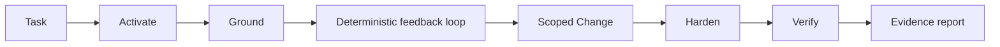
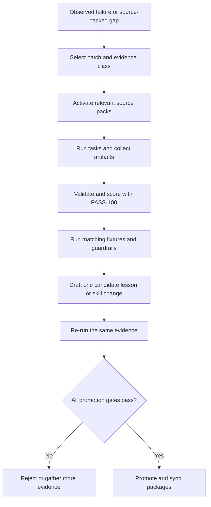

# Great Code Hygiene

**An evidence-first workflow for code review, debugging, cleanup,
hardening, and verified agent work.**

[](#claude-code)
[](#openai-codex)
[](#cursor)
[](#antigravity)
[](#quick-start)
[](docs/power-users.md#evaluation-and-pass-100)
[](https://github.com/wochaotom/Great-Code-Hygiene/releases)
[](#license)

Great Code Hygiene gives coding agents a disciplined way to work inside real
repositories. The agent reads before editing, reproduces bugs when possible,
keeps the change narrow, verifies the result with real tools, and reports what
the evidence does and does not prove.

The project packages a common hygiene loop in three editions:

- `code-hygiene` for normal code work
- `code-hygiene-compounder` for maintainers who evaluate and improve the skill
- `code-hygiene-skeleton` for users building a custom workflow from scratch

[Choose an edition](#choose-an-edition) | [Install](#quick-start) |
[When to use it](#when-to-use-it) | [How it works](#how-great-code-hygiene-works) |
[Full trainer](#how-the-full-trainer-compounds) | [Power users](docs/power-users.md)

---

## Why It Exists

Coding agents can produce a plausible patch before they understand the code,
change more than the task requires, or report success after an incomplete
check. Great Code Hygiene replaces that behavior with one canonical
[seven-stage workflow](#how-great-code-hygiene-works): activate, ground, build
a feedback loop, constrain the change, harden the affected risk surface,
verify, and report evidence.

Great Code Hygiene is an instruction and verification layer. It uses the file,
shell, test, browser, and review tools supplied by the host agent. It does not
replace your compiler, tests, linter, security scanner, reviewer, or repository
permissions.

## Choose an Edition

Install `code-hygiene` unless you have a specific reason to train or redesign
the workflow.

| Edition | What it includes | What it excludes | Use it when |
| --- | --- | --- | --- |
| Clean | Complete function-only hygiene workflow for review, fixes, refactors, hardening, package checks, documentation, and evidence reports | PASS-100 training, source packs, fixture promotion, self-mutation | You want better day-to-day agent behavior |
| Full trainer | Clean workflow plus PASS-100, weighted source packs, eval prompts, fixtures, analysis, guardrails, promotion, export, and package tools | An autonomous model runner or permission to promote without evidence | You maintain, evaluate, export, or deliberately evolve the skill |
| Skeleton | Minimal starter workflow and bootstrap questions | Inherited sources, rubric, fixtures, lessons, and promotion policy | You want a blank starting point for a different risk model or code domain |

### Clean: `code-hygiene`

The clean edition contains the complete daily workflow. It can review and edit
your project when the task asks for changes, but it does not train itself,
score itself, add sources, or run promotion loops. This is the best default for
individual developers and teams that want consistent code work without the
trainer package.

### Full trainer: `code-hygiene-compounder`

The full trainer starts with the same daily workflow and adds the machinery
used to evaluate and improve that workflow. It carries the PASS-100 rubric,
eval prompts, weighted source corpus, executable fixtures, generated test
matrices, result validators, analysis scripts, anti-overtraining budgets,
promotion tooling, and package exporters.

Training never starts merely because the skill was installed. The user must
ask for training, scoring, source-grounded honing, export, or skill evolution.
A promotion requires matched fresh-context model-execution records and an
independent review of those records, in addition to deterministic checks.

### Skeleton: `code-hygiene-skeleton`

The skeleton is a blank starting point. It preserves a small ground, constrain,
verify, and report loop but inherits no Great Code Hygiene source corpus,
PASS-100 scoring, fixtures, or promoted lessons. Use it when the intended
workflow needs different languages, risks, tools, or evidence standards.

## Quick Start

These commands install from the public GitHub repository with `npx skills`.
Install [Node.js](https://nodejs.org/) first if `npx` is unavailable.

- Clean and skeleton use: no Python dependency imposed by the skill.
- Full trainer scripts and maintainer checks: Python 3.11 or newer.
- The Claude Code plugin marketplace offers the clean edition and the full
  trainer; the Codex plugin marketplace offers the full trainer only.

### Claude Code

```bash
npx skills@latest add wochaotom/Great-Code-Hygiene --skill code-hygiene --agent claude-code --global --yes
```

Restart Claude Code, then ask:

```text
Review this repo with Code Hygiene and report verification evidence.
```

Claude decides from the skill's description whether to load it, and smaller
models often skip it. To make it the default in a project, add this line to the
project's `CLAUDE.md`:

```text
For code reviews, bug fixes, refactors, and hardening in this repo, use the code-hygiene skill.
```

To force it for one request, start the message with `/code-hygiene`, or with
`/code-hygiene:code-hygiene` when you installed it as a plugin. The
[Power User Guide](docs/power-users.md#skill-triggering) has the measured
trigger rates.

### OpenAI Codex

```bash
npx skills@latest add wochaotom/Great-Code-Hygiene --skill code-hygiene --agent codex --global --yes
```

Invoke it explicitly when you want to guarantee activation:

```text
$code-hygiene review this repo and report verification evidence.
```

To make it the default in a project, add the same line used for Claude Code to
the project's `AGENTS.md`, which Codex reads as project instructions:

```text
For code reviews, bug fixes, refactors, and hardening in this repo, use the code-hygiene skill.
```

### Cursor

```bash
npx skills@latest add wochaotom/Great-Code-Hygiene --skill code-hygiene --agent cursor --global --yes
```

For a project-level nudge, copy the repository's
`.cursor/rules/code-hygiene.mdc` rule into the project's `.cursor/rules/`
folder. Cursor offers the rule to the agent when a request matches its
description; see the [Power User Guide](docs/power-users.md#manual-fallbacks)
for the copy commands.

### Antigravity

```bash
npx skills@latest add wochaotom/Great-Code-Hygiene --skill code-hygiene --agent antigravity --global --yes
```

The documented `npx skills` targets are `claude-code`, `codex`, `cursor`, and
`antigravity`.

### Install the Full Trainer or Skeleton

Use the same command shape and change `--skill`:

```bash
# Full trainer
npx skills@latest add wochaotom/Great-Code-Hygiene --skill code-hygiene-compounder --agent <agent> --global --yes

# Blank skeleton
npx skills@latest add wochaotom/Great-Code-Hygiene --skill code-hygiene-skeleton --agent <agent> --global --yes
```

### Plugin Marketplaces

The Claude Code marketplace offers two plugins: `code-hygiene`, the clean
edition for everyday work, and `code-hygiene-compounder`, the full trainer with
its training and package tools. Install `code-hygiene` unless you maintain or
train the skill.

Inside Claude Code:

```text
/plugin marketplace add wochaotom/Great-Code-Hygiene
/plugin install code-hygiene@great-code-hygiene
/reload-plugins
```

For the full trainer, install `code-hygiene-compounder` instead:

```text
/plugin install code-hygiene-compounder@great-code-hygiene
```

The Codex marketplace offers only `code-hygiene-compounder`. With the Codex CLI:

```bash
codex plugin marketplace add wochaotom/Great-Code-Hygiene
codex plugin add code-hygiene-compounder@great-code-hygiene
```

Use the `npx skills` path for the skeleton, or for the clean edition outside
Claude Code. Update, uninstall, manual-copy, and Windows long-path instructions
live in the [Power User Guide](docs/power-users.md).

### ChatGPT, Claude, and Gemini

Web chatbots do not install coding-agent skills. Use the matching profile as
custom instructions and attach the portable prompt when the platform supports
knowledge files:

- [ChatGPT GPT instructions](chatbot-profiles/chatgpt-gpt-instructions.md)
- [Claude project instructions](chatbot-profiles/claude-project-instructions.md)
- [Gemini Gem instructions](chatbot-profiles/gemini-gem-instructions.md)
- [Portable compounder prompt](portable-prompts/code-hygiene-compounder-chat.md)

A chatbot still needs uploaded files, pasted context, or an authorized
connector to inspect a repository. It cannot prove that a command passed unless
it can run the command or you provide the output.

## When to Use It

Use Great Code Hygiene for work where the quality of the reasoning, change, and
verification matters:

- Code review, pull request review, branch review, and repository risk audits.
- Bug fixes, regressions, flaky behavior, and production failure diagnosis.
- Refactors and cleanup that must preserve public or internal behavior.
- Security and data-safety hardening, with dedicated security tools added when
  the risk warrants them.
- Test repair, test design, CLI harnesses, browser checks, and replay fixtures.
- Package, dependency, configuration, migration, CI, release, and install work.
- Documentation cleanup when docs describe executable behavior or public
  contracts.
- Evidence-based verification of work performed by another agent or developer.
- Deliberate PASS-100 evaluation and source-grounded skill training with the
  full trainer.

Explicitly name the skill for high-risk tasks or when the host may not activate
skills automatically.

## When Not to Use It

Great Code Hygiene should not become ceremony around work that a narrower tool
can prove directly.

- Use the repository formatter for formatting-only changes.
- Use the compiler or type checker when the question is only whether code
  compiles or type-checks.
- Use a dedicated security review or threat model for broad security audits;
  Code Hygiene can coordinate checks but does not replace security expertise.
- Do not use the full trainer for routine code changes. Install the clean
  edition instead.
- Do not use PASS-100 as a public model leaderboard or compare different
  evidence classes as the same measurement.
- Do not treat generated fixtures, matrix oracles, or a clean package check as
  proof that an agent solved a real task.
- Do not ask the skill to claim test success when the host has no execution
  access and no command output was supplied.
- Do not train the skill from one surprising example. Record it as candidate
  evidence until an independent recurrence or stronger source supports it.

## How Great Code Hygiene Works

The host agent discovers the skill from its name and description or loads it
because you invoke it directly. The skill then applies the same seven-stage
workflow to reviews, fixes, refactors, hardening, package checks, and docs.



### 1. Activation

The skill activates in one of two ways:

- The host matches the task to the skill description.
- You invoke `code-hygiene` or `code-hygiene-compounder` by name.

Automatic discovery depends on the host. Explicit invocation is the reliable
choice for consequential work. Activation loads procedure, not authority: the
agent still has only the files, commands, network access, and permissions
granted by the host.

### 2. Grounding

Before judging or editing, the agent reads the evidence that defines the local
contract:

- repository instructions and current worktree state
- relevant implementation, callers, tests, types, manifests, and config
- local conventions, helper APIs, generated boundaries, and public contracts
- user-owned changes that must not be reverted

The agent prefers existing frameworks and repository patterns over a new
abstraction. If the task is bounded to a file, fixture, package, or scratch
directory, status and discovery stay within that scope.

### 3. Deterministic Feedback Loop

For a bug, regression, or flaky behavior, the agent first builds the smallest
repeatable loop that observes the symptom. Suitable loops include:

- a focused unit or integration test
- a CLI command or reduced script
- browser automation for a user-visible flow
- a replayed fixture or captured trace
- a deterministic inspection query when execution is impossible

The first loop should be narrow enough to explain the failure. Broader checks
come later. If no deterministic loop is possible, the evidence report names
what was attempted and which artifact, access, service, or environment is
missing.

### 4. Scoped Change

The agent makes the smallest behavior-correct change that satisfies the task.
It preserves unrelated user edits, public interfaces, serialization formats,
configuration precedence, migration behavior, and caller-owned mutable data
unless the request changes those contracts.

The workflow rejects opportunistic rewrites, broad formatting sweeps,
dependency churn, generated noise, and abstractions that do not remove real
complexity.

### 5. Risk-Driven Hardening

The agent checks only the hardening dimensions activated by the changed
surface. Examples include:

- input validation, authorization, secrets, injection, unsafe deserialization,
  path handling, privacy, and dependency risk
- errors, logs, retries, timeouts, cleanup, concurrency, and observability
- config defaults and precedence, migration rollback, compatibility, and
  package boundaries
- tests for behavior changes, regression-prone paths, and public contracts

This is risk-driven, not a demand to run every possible audit on every diff.

### 6. Verification

Verification proceeds from the smallest meaningful check to broader guards:

1. Re-run the feedback loop that observed the bug or contract.
2. Run adjacent tests, validation, type checks, builds, or package checks that
   cover the changed boundary.
3. Inspect the final diff and user-facing artifact.
4. Report failed or unavailable checks without hiding them.

Fresh command output supports a passing claim. Prior runs, generated summaries,
agent confidence, and an uninspected artifact do not.

### 7. Evidence Report

Implementation work ends with a compact evidence record:

| Field | What it records |
| --- | --- |
| Feedback Loop | Reproducer used before the fix, or the exact blocker |
| Verification | Commands and checks run with actual results |
| Evidence Table | Expected result, actual result, status, and artifact |
| Correctness | Behavior preserved or intentionally changed |
| Security/Data | Relevant validation, authorization, secrets, path, and privacy checks |
| Minimal Diff | Why the change stayed within scope |
| Unrun Checks | Checks skipped and the reason |
| Residual Risk | Remaining uncertainty |

Reviews use the same evidence model after listing findings by severity. The
full template is in
[`references/evidence-report.md`](code-hygiene-compounder/references/evidence-report.md).

## Task Modes

The core workflow stays stable while the emphasis changes by task.

| Mode | First concern | Minimum convincing evidence |
| --- | --- | --- |
| Review | Behavioral bugs, regressions, risk, and missing tests | File and line evidence plus the checks actually run |
| Debug or fix | Reproducing the reported symptom | Original loop fails before the fix and passes after it when feasible |
| Refactor or cleanup | Behavior preservation | Characterization or existing tests plus a scoped diff |
| Hardening | Exploitable or unsafe path and safe control | Regression check for the unsafe path plus a valid safe case |
| Package or config | Install, load, precedence, and consumer compatibility | Manifest/config validation plus an adjacent consumer command |
| Documentation | Accuracy against executable behavior | Link/content checks and inspection of referenced commands or files |

## Evidence Model

The full trainer labels evidence so a convenient check cannot masquerade as a
stronger result.

| Evidence class | What happened | What it can support |
| --- | --- | --- |
| `script-only` | Scripts generated batches, validated JSON, calculated scores, or exercised harness plumbing | Harness and artifact correctness, not model quality |
| `audit-backed` | A real session was scored from observed work, artifacts, and reviewer judgment | Candidate lessons and real-use findings, with reviewer subjectivity stated |
| `model-execution` | A model or agent received the task prompt and its actual output was collected and scored | Stronger evidence about behavior for that model, skill version, and run setup |

Generated matrix variants and individual fixture misses are candidate evidence.
They can reveal a failure family but cannot establish a major promotion by
themselves. Different run types must remain separate in analysis.

## How the Full Trainer Compounds

The compounder turns observed failures into candidate improvements without
letting one task rewrite the skill.



The loop has four safeguards:

- Source routing activates only the admitted packs relevant to the task.
- PASS-100 labels `script-only`, `audit-backed`, and `model-execution` evidence
  separately instead of treating every green artifact as model proof.
- Sparse fixtures, generated matrices, and independent real tasks cover
  different failure modes without becoming one interchangeable score.
- Promotion requires versioned execution artifacts, independent review,
  baseline, category, fixture, package, and overtraining gates; phase
  advancement remains a human decision.

The source-admission policy, complete PASS-100 rubric, promotion controls, and
responsibility map for all 12 deterministic scripts are in
[Full Trainer Internals](docs/power-users.md#full-trainer-internals).

## Packaging and Hosts

The canonical workflows are packaged for each host rather than maintained as
independent implementations. `npx skills` installs one selected edition;
Claude Code and Codex marketplaces install the full trainer; chat products use
profiles and a portable prompt. The host still controls discovery, tools,
permissions, and execution semantics.

Package parity checks prove that tracked copies match their canonical source.
They do not prove identical behavior across hosts. See the
[Install Matrix](docs/power-users.md#install-matrix),
[Source of Truth](docs/power-users.md#source-of-truth), and
[Package Targets](docs/power-users.md#package-targets) for the complete map.

## Prompt Examples

### Review

```text
Review this repo with Code Hygiene.
Focus on correctness, regressions, tests, security/data safety, config, and packaging.
Report findings first, then verification evidence and residual risk.
```

### Debug or Fix

```text
Use Code Hygiene to fix this failing check:
Check: <command>
Guard: <optional broader command>
Build the smallest deterministic feedback loop before changing code.
```

### Scoped Cleanup

```text
Scrub <folder-or-file> with Code Hygiene.
Preserve behavior and unrelated user edits.
Report the exact checks run.
```

### Verify Existing Work

```text
Verify this implementation with Code Hygiene.
Inspect the final diff and artifact instead of trusting the prior report.
List unrun checks and residual risk.
```

### Train the Full Edition

```text
Use Code Hygiene Compounder to evaluate this candidate lesson.
Run the matching PASS-100 batch and fixtures.
Treat new evidence as candidate evidence.
Do not promote unless every required gate passes.
```

## Trust Boundaries and Limitations

- A skill is instruction, not a sandbox. Host permissions and tool policy remain
  the enforcement boundary.
- The workflow can reduce unsupported claims but cannot make an unavailable
  test, service, credential, device, or production environment observable.
- A passing deterministic check proves only the behavior that check covers.
- PASS-100 contains judgment-dependent categories. Record deductions,
  artifacts, model identity, skill version, and unrun checks with each run.
- Plugin and skill installation executes the behavior supported by the target
  client. Review repository source, manifests, hooks, scripts, and updates
  before granting broad authority.
- Chat-only profiles provide procedure but no repository access or execution
  capability by themselves.

## For Power Users

The [Power User Guide](docs/power-users.md) contains the operational reference:

- update and removal commands
- manual installation fallbacks
- skill install versus plugin install behavior
- package source-of-truth and generated-copy map
- maintainer validation and fixture commands
- Codex plugin configuration and Windows long-path handling
- release tagging, archive generation, and checksums

Versioned archives and SHA-256 checksums are published in
[GitHub Releases](https://github.com/wochaotom/Great-Code-Hygiene/releases).

## FAQ

### Does it run automatically?

It can. Skill-aware clients may activate it when a task matches the skill
description. Explicitly name `code-hygiene` or `code-hygiene-compounder` when
activation matters.

### Does it replace tests or code review?

No. It makes the agent locate, build, run, and report the relevant evidence. A
human reviewer and the repository toolchain remain authoritative.

### Can the clean edition modify my code?

Yes. Function-only means that it does not train or mutate itself. It can edit
the user's project when the requested task calls for a fix, refactor, cleanup,
hardening change, test, or documentation update.

### Does the full trainer improve itself automatically?

No. Training must be requested. Candidate changes remain unpromoted until the
required evidence and guardrails pass, and phase advancement stays under human
control.

### Is PASS-100 a benchmark?

PASS-100 is this project's hygiene rubric. It structures evaluation but does
not create objective model-performance proof. Keep `script-only`,
`audit-backed`, and `model-execution` results separate.

### Why are there three editions in one repository?

They share one workflow but serve different trust boundaries. Maintaining them
on `main` lets package validation check the clean and trainer copies together.
Users install only the edition they need.

## License

Great Code Hygiene is licensed under the Apache License, Version 2.0. See
[LICENSE](LICENSE) and [NOTICE](NOTICE).
